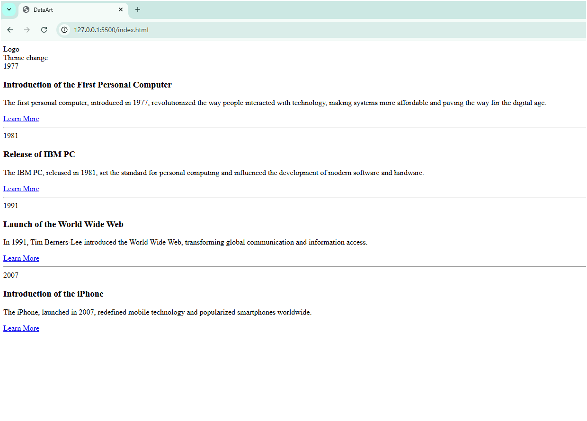

# **Timeline Project**

## **Stage-1 Description**
This project implements a basic timeline interface as part of an assignment. The current version includes:

- **Header**: A header with a placeholder logo and theme toggle.
- **Navigation**: A navigation section reserved for future filters or placeholders.
- **Timeline Section**: A timeline section (`#timeline`) with event markers for 1977, 1981, 1991, and 2007, each within an `<article>` tag.
- **Modal**: An empty modal div (`#modal`) for future pop-ups.
- **Semantic Tags**: Semantic HTML tags (`<main>`, `<article>`, `<figure>`) to structure the content, with `<figure>` tags added as placeholders for images or media.

**Future Stages**: Will involve adding CSS for styling and JavaScript for interactivity, including filters, pop-ups, and dynamic event loading.

## **Image Example**

